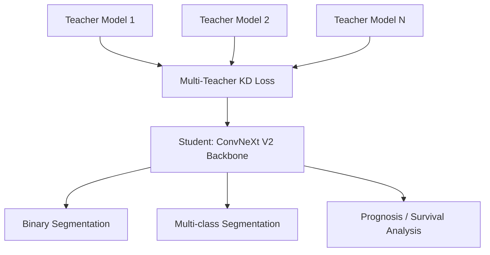

# Pandora

<div align="center">

**Pandora** — A Computational Pathology Foundation Model via Multi-Teacher Knowledge Distillation

[](https://www.python.org/)
[](https://pytorch.org/)
[](LICENSE)

</div>

---

## Overview

**Pandora** is a research repository for Computational Pathology (CPath), designed to learn universal pathological representations through multi-teacher knowledge distillation . The larned backbone can be directly applied to multiple downstream tasks.

---

## Model Architecture

Pandora uses **ConvNeXt V2** as the visual backbone, trained with a multi-teacher knowledge distillation strategy to distill complementary knowledge from multiple expert pathology models into a single unified encoder.



---


## Pretrained Weights

Pretrained model weights are available on 🤗 Hugging Face:

> **[`pandora` on Hugging Face Hub](https://huggingface.co/ThoroughFuture/pandora)**

| Model | Backbone | Parameters | Download |
| :---: | :---: | :---: | :---: |
| `Pandora-N` | ConvNeXt V2-Nano | ~15M | [`Pandora_N.pt`](https://huggingface.co/ThoroughFuture/pandora/blob/main/Pandora-N.pt) |
| `Pandora-T` | ConvNeXt V2-Tiny | ~28M | [`Pandora_T.pt`](https://huggingface.co/ThoroughFuture/pandora/blob/main/Pandora-T.pt) |
| `Pandora-B` | ConvNeXt V2-Base | ~89M | [`Pandora_B.pt`](https://huggingface.co/ThoroughFuture/pandora/blob/main/Pandora-B.pt) |
| `Pandora-L` | ConvNeXt V2-Large | ~198M | [`Pandora_L.pt`](https://huggingface.co/ThoroughFuture/pandora/blob/main/Pandora-L.pt) |
| `Pandora-H` | ConvNeXt V2-Huge | ~659M | [`Pandora_H.pt`](https://huggingface.co/ThoroughFuture/pandora/blob/main/Pandora-H.pt) |

---

## Quick Start

### Installation

```bash

# 1. Create a conda environment (recommended)
conda create -n pandora python=3.10 -y
conda activate pandora

# 2. Install PyTorch (CUDA 11.8)
pip install torch==2.4.0+cu118 torchvision==0.19.0+cu118 torchaudio==2.4.0+cu118 \
    --index-url https://download.pytorch.org/whl/cu118

# 3. Install remaining dependencies
pip install -r requirements.txt
```

### Load Pretrained Backbone

The minimal example below loads the **Pandora-B** backbone for feature extraction:

```python
import torch
import torch.nn as nn
from pandora.model.convnextv2 import ConvNeXtV2


class PandoraBackbone(nn.Module):
    """Pandora-B backbone for feature extraction.

    Loads pretrained ConvNeXt V2-Base weights and removes the
    classification head, exposing raw spatial feature maps.
    """

    def __init__(self, weight_path: str):
        super().__init__()
        self.encoder = ConvNeXtV2(
            depths=[3, 3, 27, 3],
            dims=[128, 256, 512, 1024],
        )
        # Remove the classification head; keep the feature extractor only
        self.encoder.head = nn.Sequential()
        self.encoder.load_state_dict(
            torch.load(weight_path, map_location="cpu")
        )

    def forward(self, x: torch.Tensor) -> torch.Tensor:
        return self.encoder(x)


if __name__ == "__main__":
    model = PandoraBackbone(weight_path="pandora_B.pt")
    model.eval()

    dummy = torch.randn(1, 3, 256, 256)
    with torch.no_grad():
        features = model(dummy)

    print(f"Output feature shape: {features[0].shap}")
```

---
